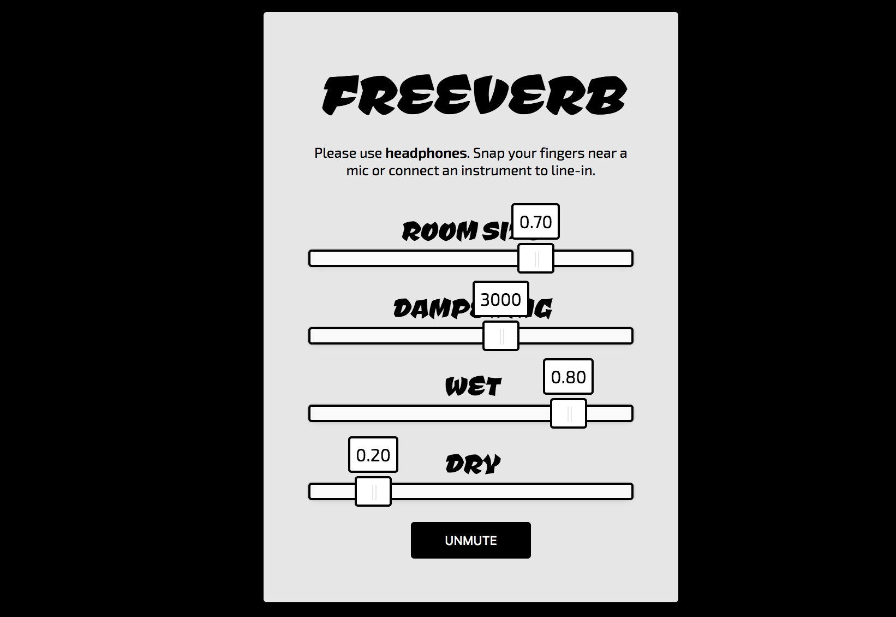

# Web Audio Experiments

Various experiments with Web Audio API

projects are organized using [lerna](https://www.npmjs.com/package/lerna)

## Start a project

To start any project ending with `-app` do:
```
npx lerna bootstrap
cd packages/[project-name]-app
npm start
```

## Tape app

https://amiselaytes.com/tape


## Loop app

https://amiselaytes.com/loop


## Freeverb app

https://amiselaytes.com/freeverb


