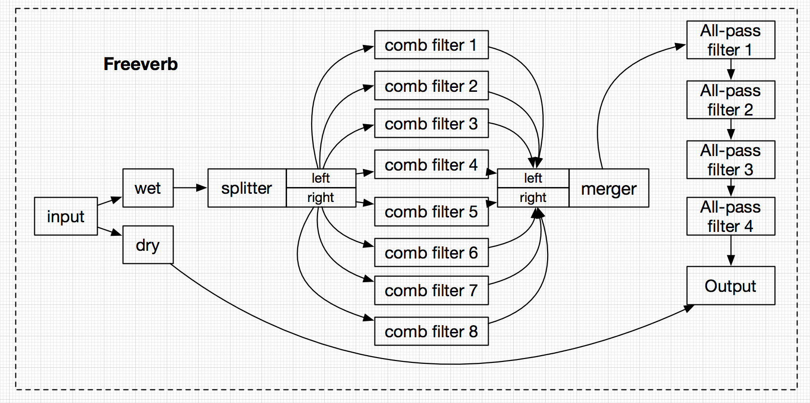

# Freeverb

A Web Audio implementation of [Freeverb](https://ccrma.stanford.edu/~jos/pasp/Freeverb.html) (an algorithmic reverb)


```javascript
//create an instance
const Freeverb = require('Freeverb')
const audioCtx = new AudioContext()
const opts = { dampening: 3000, roomSize: 0.7, dryGain: 0.2, wetGain: 0.8 }
const freeverb = new Freeverb(audioCtx, opts)

//connect
someInput.connect(freeverb).connect(audioCtx.destination)

//diconnect
freeverb.disconnect()
```


`dampening`, `roomSize`, `dryGain` and `wetGain` implement [Audio Params API](https://developer.mozilla.org/en-US/docs/Web/API/AudioParam)
