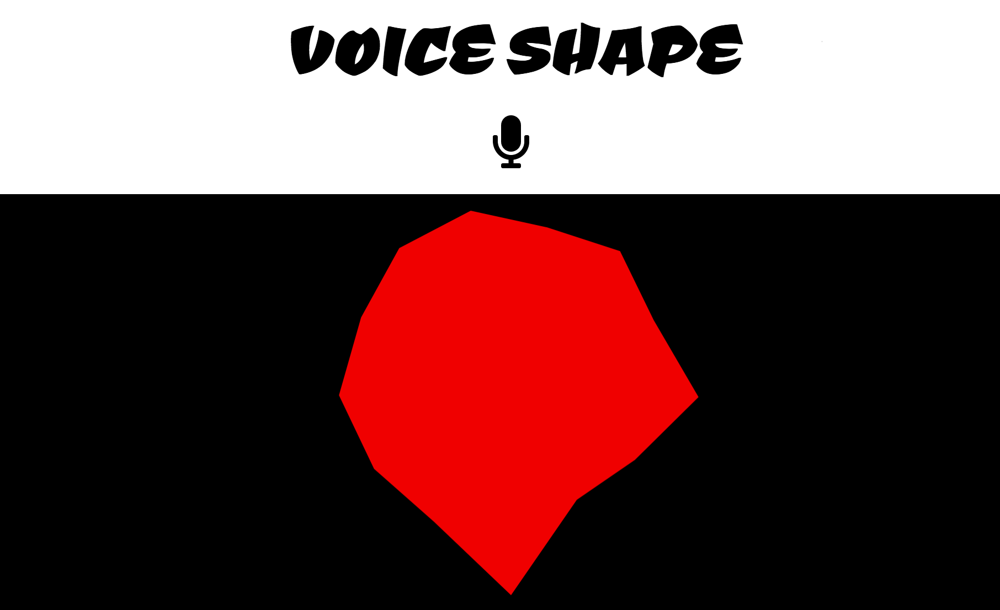

## Voice shape app

The idea here is to create a shape which represents voice characteristics. Each angle of the shape shows a [Mel coefficient](http://practicalcryptography.com/miscellaneous/machine-learning/guide-mel-frequency-cepstral-coefficients-mfccs).
These are often used in speaker recognition. Shape color is defined by how high or low the voice is ([spectral centroid](https://en.wikipedia.org/wiki/Spectral_centroid)). 
Finally shape size is based on perceived loudness of the sound.

[demo](https://amiselaytes.com/webaudio/voice)

